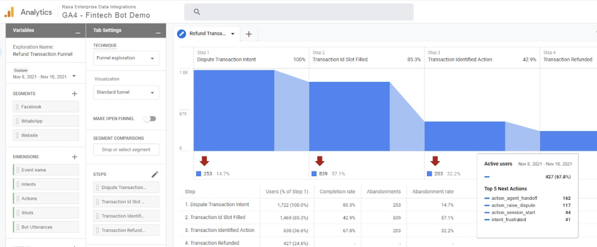

## Who we are
At ScaleVector we are dedicated to solving hard data engineering and AI problems in the enterprise. Along the way, we’ll be building novel technology and will share our learnings with the community.

## Why

If you’ve been fortunate enough to work for a startup company and a large corporate, you’d know that there are big differences between the two. Visiting a startup, you can’t help but noticing the magic in the air and everyone’s bright-eyed passion, ownership, creative thinking, sense of urgency, and speed of execution. Smaller teams have these in abundance, but as companies turn into corporations, they become slower, and people become comfortably numb.

At ScaleVector we think there needs to be a way to keep people focused on doing big things, while maintaining a startup atmosphere. That’s hard when you’re small, and impossible when you’re too big.

So we set out to support a new type of enterprise, one that tries to borrow from the good of both worlds — maturity and scale from corporations; agility, creativity and raw passion from startups. We think there's a next evolutionary step in the development of organizations, and it has to be invented and applied. We think companies will rely more and more on AI to run their routine and complex tasks better and cheaper than us humans.

ScaleVector is currently working on the following set of related problems:

 ---
 
 

  

 
### Language Models For Enterprise Software Development Automation 

Language models like GPT-3 were tried to generate source code but with moderate success. Currently solutions like [Github Copilot](https://copilot.github.com/) which generate code snippets look the most promising. They are, however, far from replacing human developers and allowing end to end automation. 

In Scalevector we think that applying language and other AI models to <u>the testing of software</u> will be much more frutiful and amenable to full automation. 

We built a few prototypes to gain some understanding of the performance of GPT-3 in this context. In one of the working prototypes, a dialogue generation tool, we have learned how to prime GPT-3 to impersonate a human with a desired personality, mood and goals to achieve. We used the prototype in conversations with (Carbon Bot)[https://github.com/RasaHQ/carbon-bot] to discover if GPT-3 can follow complex scenarios, find edge cases and produce novel dialogues not expected by the developers.

The results are promising and such tool can be easily integrating into existing testing pipelines in order to replace humans in end to end/exploratory testing.

 ---
 
 

  

 
### Data Pipelines For Complex Data

How should ingesting and structuring complex data (such as human language data) in an enterprise environment look like? 
We have shipped pipelines for chat bot conversational data, supporting AWS and GCP with generic schemas and metrics that enterprises can deploy within days.

Related problems:
- ingestion of event streams in form of JSON objects into databases
- automatic relational schema inference from nested JSON objects with on the fly migrations
- transforming event based data into a semantic data model for human usage
- simple default deployment and shifting all customizations that require Data Engineering resources to DBT packages
 ---
 
 

  

 
### Early ROI Of Your Enterprise AI Automation

When starting to deploy next-genaration AI automation, Enterprises often struggle to understand their ROI. From a business perspective they need this ROI to justify further investment and production roll-out.

Our clients already have tools, workflows and teams in place, to understand the performance of their mobile and web apps. Interestingly, platforms they use (like Google Analytics or Segment + Amplitude combo) are shifting towards analytics that can tackle stream of events coming from any source.

At Scalevector we are able to transform and ingest an event stream, produced by any automation process, into Google Analytics 4. This allows our clients to use reporting and advanced exploration features of GA4 for data beyond web and mobile apps. 

  

*A funnel for Transaction Dispute scenario of Financial Bot Demo*

On the client side setup does not require any configuration and development resources. As with web and mobile apps, it can be done by the client's marketing or other non technical team directly in GA4 UI.

We think of Google Analytics as a free solution for complex event analysis, a first step to a data store with further use cases.
 
 ---
 
 

  

 
### "Keep Your Notebook, Use The Enterprise Data Warehouse"  

Data scientists working on AI problems love to work in notebooks such as Jupyter Notebooks or Google Collab. 
At the same time it is difficult for them to access enterprise data with these tools and methods that are common to them such as Pandas.  

At ScaleVector we allow our clients to access their enterprise data in their notebooks via the Metabase API. 
Related problems:

- complex analysis and visualisation via the Metabase API
- Visual query builder for curated data, so you don't have to write complex SQL
- API access to a single source of truth

 ---
 
 

  

 
### Quantifying The Level 3 Assistants Market Among The Fortune 500  

The market for enterprise automation is booming, especially now that enterprises have to adapt to remote, work from home and hybrid office mode models. 
But what are the technologies adopted? To assess [level 3 assistant](https://rasa.com/blog/5-levels-of-conversational-ai-2020-update/) adoption among the Fortune 500 we are building:
- different approaches to scraping the data (Google vs the Linkedin API)
- experiments on how identify level 3 teams and the technology they use
- a classification and analysis layer

 ---
 
 

  

 
### Data Models For AI Enterprise Teams  

Every company has this idealized vision of a AI, data science and analytics team, with full visibility into how the business is doing, how the product gets used, how experiments are performing. The problem with getting there (and this is part of why data teams don’t get hired until later in the company lifecycle) is that the actual, cold hard data that you need to answer important questions typically lies all over the place. And it needs cleaning. 

Data teams write intermediate SQL queries that format source data in a way that makes it easier to answer  high level questions. A few examples of those kinds of transformations:
- Aggregating all of the different types of product events into one table that keeps track of product state.
- Arranging your Stripe data to calculate MRR by month
- Grouping website visits into “sessions” for easier analysis

Mature data teams will have hundreds of these kinds of transformations. When you group all of these together, you’ve got what is called a data model.

We help clients by building models of 90% of their data with a tool called dbt. dbt is a toolset for building data models. It lets data teams run SQL to build models, add documentation to each table, manage the semantic schema deployment, run tests to ensure data quality, and many other nice things. Without customization enterprise data pipelines are unusable. With our dbt packages it is easy for our clients to customize pipelines of the remaining 10% of data so they can use the pipeline.

 ---
 
 

  

 
### Towards Negative Data Engineering  

Companies have an idealized vision of how data engineers work, as well. Observationally data enginners spend 50% of their time fixing broken data pipelines. Negative engineering is usually not done in data. Negative data engineering is when engineers write defensive code to make sure the positive code actually runs. Negative engineering is characterized by needing to anticipate this infinity of possible failures.

By leveraging past experiences, we created a simple framework for resilient pipelines. We are in the early innings of having of some of our data engineering friends testing it. 

 ---
 
 

  

### Gamers First, Again ?   

While a lot of automation happens in the enterprise, we are also curious about other affected industries. From our own experience we know that often it is game developers that are usually the first to deploy new technologies en masse before everyone else. 

Based on that insight we running some experiments. Can we apply some of the enterprise-grade automation on gaming platforms such as Discord?  
 
---
 

  

### Metabase In The Enterprise

We work heavily with Metabase, a popular open source business intelligence tool. The companies we work with often have multiple versions of Metabase (eg development vs production, improvements). 

We created a migration pipeline that allows easy deployment of templates from a development or demo instance to a production instance of Metabase. It allows for copy entire configurations between instances (such as dashboards, cards, colections)

---

## Get in touch
If you are an engineer or enterprise interested in any of these problems, get in touch ---> matthaus at scalevector.ai

